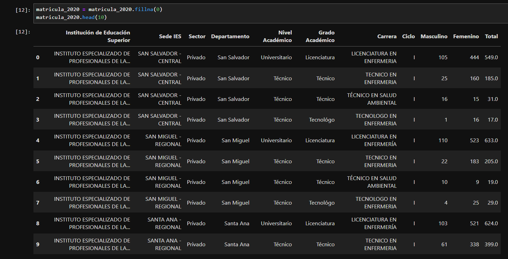

# ProySIC-2024

# Desarrollo de Software para Apoyo Educativo Orientado a Mejorar la Experiencia de Aprendizaje con Herramientas Personalizadas y Adaptativas.

## Tabla de contenidos
1. [Descripción](#Descripción)
2. [Arquitectura](#Arquitectura)
3. [Proceso](#Proceso)
4. [Estado del proyecto](#EstadoDelProyecto)
5. [Conclusion](#Conclusion)

# Descripción

# Arquitectura

# Proceso

* Fuente del dataset
https://www.mined.gob.sv/educacion-superior/?wpdmc=informacion-estadistica-de-educacion-superior

* Limpieza de datos
-Se realizó la limpieza haciendo uso de fillna(0), para rellenar los datos vacios y poder hacer uso de toda la data de los csv

* Estadísticos
1. Gráfico pie
2. Gráfico scatter
3. Gráfico plot
4. Gráfico barh
5. Gráfico bar
6. Gráfico stem
7. Gráfico colorbar
8. Gráfico contourf

# EstadoDelProyecto

# Conclusion
Al analizar los datos de matriculación y egresados de diversas universidades de El Salvador entre 2020 y 2023, se evidencian algunas tendencias clave que resaltan la importancia del proyecto "Desarrollo de Software para Apoyo Educativo Orientado a Mejorar la Experiencia de Aprendizaje con Herramientas Personalizadas y Adaptativas".

Primero, se observa una disminución significativa en la cantidad de estudiantes matriculados, pasando de más de 300,000 en 2020 a menos de 200,000 entre 2021 y 2023. Este descenso refleja un posible desinterés por continuar los estudios, lo que plantea un reto importante para las instituciones educativas. Sin embargo, la tasa de graduación, especialmente en 2023, muestra un incremento positivo, alcanzando un 50% en algunos casos. Esto sugiere que aquellos estudiantes que permanecen en el sistema educativo tienen mayores probabilidades de graduarse, lo que resalta la efectividad de ciertos programas y herramientas. Sin embargo, la disminución en las matrículas indica que más esfuerzos deben centrarse en motivar a los estudiantes a inscribirse y permanecer en sus estudios.

La implementación de software educativo adaptativo y personalizado podría ser una solución clave para revertir esta tendencia. Al ofrecer herramientas que se ajusten al ritmo y estilo de aprendizaje de cada estudiante, es probable que se logre un aumento en la matrícula, lo que a su vez podría incrementar el número de egresados. Además, es esencial que estas herramientas sean compatibles con dispositivos de bajo costo y ofrezcan opciones offline, garantizando el acceso independientemente de la situación económica de los estudiantes.

Finalmente, la capacitación docente juega un papel crucial en el éxito de estas herramientas. Los datos sugieren que mejorar la formación de los docentes en el uso de tecnologías educativas adaptativas podría tener un impacto positivo en la tasa de graduación. Así, un enfoque integral que combine software adaptable, accesibilidad económica y formación continua de los docentes podría ayudar a mantener y aumentar tanto las matrículas como los egresos, asegurando que más estudiantes tengan la oportunidad de completar sus estudios universitarios de manera exitosa.
